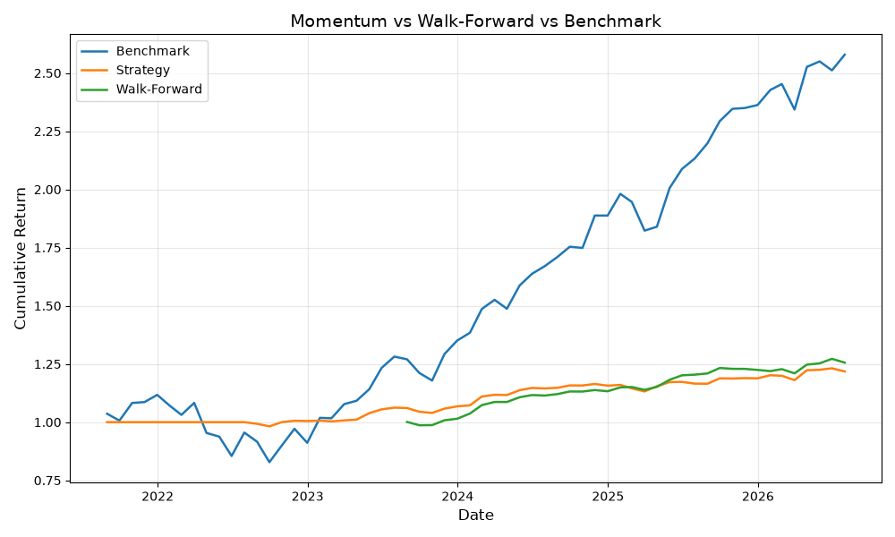

# Equity Backtesting Engine — v1 (In Progress)
 
This is a momentum-based equity backtesting engine built in Python. It works by buying the top 3 performing stocks by a 12-month return each month and it rebalances monthly.
 
## How it works
 
Each month, the strategy ranks stocks by their 12-month returns. The top 3 performing stocks are then bought equally weighted and held for a month. At the end of the month, the strategy rebalances by selling the current holdings and buying the new top 3 performing stocks, and a 0.1% transactional cost is applied each time holdings change.
 
The signal is shifted by one month to avoid lookahead bias, so last month's momentum would decide this month's holdings.
 
**New in v1 — Walk-Forward Testing:** rather than training and testing the signal on the same fixed period, the strategy now trains on a rolling 24-month window and tests on the following 6 months, sliding forward through the entire dataset. This simulates genuinely not knowing the future at each decision point, giving a more honest measure of whether the momentum signal holds up out-of-sample.
 
**Coming next in v1 — Low Volatility Signal:** a second, independent signal ranking stocks by 30-day rolling volatility, to be tested alongside momentum before the two are properly combined into a composite ranking in v2.
 
## Universe
 
**v0 (10 stocks):** AAPL, MSFT, NVDA, AMZN, GOOGL, META, TSLA, JPM, V, NFLX (Apple, Microsoft, Nvidia, Amazon, Google, Meta, Tesla, JP Morgan, Visa, Netflix)
 
**v1 (20 stocks):** expanded to include JNJ, PFE, XOM, CAT, COST, WMT, BA, GE, PG, AXP (Johnson & Johnson, Pfizer, Exxon Mobil, Caterpillar, Costco, Walmart, Boeing, General Electric, Procter & Gamble, American Express)
 
## v0 Results (June 2023 – June 2026)
 
| Metric             | Strategy | Benchmark |
|--------------------|----------|-----------|
| Total Return       | 15.7%    | 111.9%    |
| Annualised Return  | 5.0%     | 28.5%     |
| Sharpe Ratio       | 0.86     | 1.46      |
| Max Drawdown       | -5.4%    | -13.2%    |
 

 
## v1 Results So Far (5 years, 20 stocks)
 
| Metric             | Strategy | Benchmark | Walk-Forward |
|--------------------|----------|-----------|---------------|
| Total Return        | 21.8%    | 157.9%    | 25.6%          |
| Annualised Return    | 4.0%     | 20.9%     | 4.7%           |
| Sharpe Ratio         | 1.08     | 1.16      | 1.83           |
| Max Drawdown          | -2.8%    | -25.9%    | -1.9%          |
 

 
## Observations
 
**v0 Observations**
 
The momentum strategy significantly underperformed the equal-weight benchmark over the 3-year period (15.7% vs 111.9% total return). However, the strategy had a considerably lower max drawdown (-5.4% vs -13.2%), suggesting it was more conservative in avoiding large losses.
 
The Sharpe ratio (0.86) indicates the strategy generated modest risk-adjusted returns but still fell short of the benchmark (1.46). This is likely due to the limited universe of 10 stocks and the simple 12-month momentum signal without additional filters.
 
**v1 Observations**
 
Expanding the universe to 20 stocks and running over 5 years, the in-sample momentum strategy still underperforms the benchmark in raw returns (21.8% vs 157.9%), but continues to show a considerably lower max drawdown (-2.8% vs -25.9%) — the strategy trades return for stability.
 
The walk-forward out-of-sample results are the more interesting finding here. Despite only having access to information available at each point in time, the walk-forward strategy actually achieved a higher Sharpe ratio (1.83) than both the in-sample strategy (1.08) and the benchmark (1.16), alongside the lowest max drawdown of the three (-1.9%). This suggests the momentum signal is not simply overfitted to one fixed historical period — it holds up reasonably well when forced to make decisions using only past information, which is a genuinely encouraging sign for the strategy's robustness.
 
That said, both the strategy and walk-forward versions still lag the benchmark's raw returns significantly. This is likely because momentum alone is a weak standalone signal, and a 20-stock universe with only one factor leaves a lot of alpha on the table compared to simply holding the market. The low volatility signal currently in progress will test whether a second factor improves this picture.
 
## How to run
 
pip install yfinance pandas matplotlib
 
python main.py
 
## What's next
 
- Finish the low volatility signal and test it independently alongside momentum (v1)
- Combine momentum and low volatility into a proper composite signal, add a value factor, and run factor regressions once the Probability & Statistics module is complete (v2)