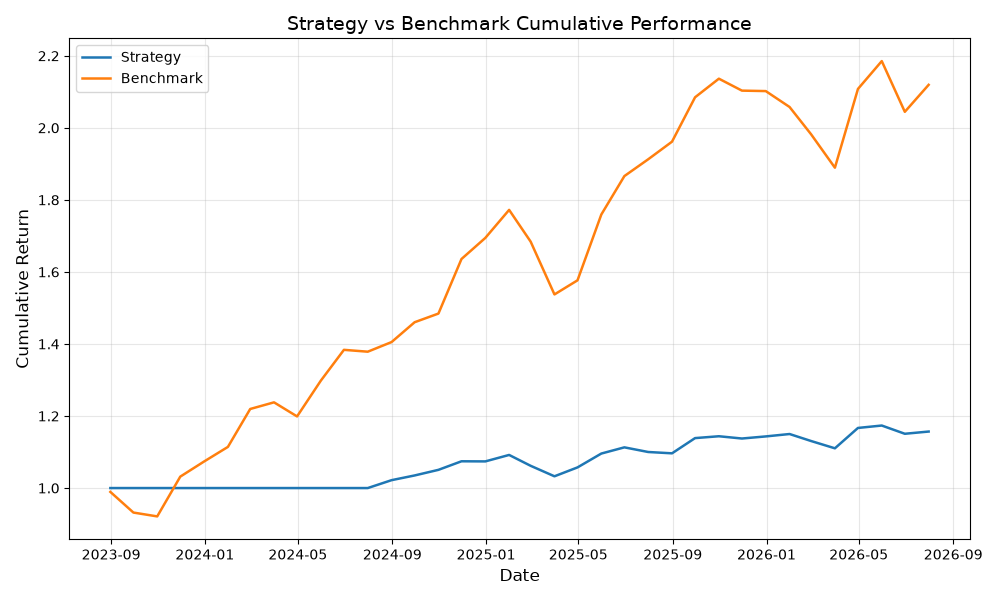

# Equity Backtesting Engine — v0

This is a momentum-based equity backtesting engine built in Python. It works by buying the top 3 performing stocks by a 12-month return each month and it rebalances monthly. 

## How it works 

Each month, the strategy ranks 10 US stocks by their 12-month returns. The top 3 performing stocks are then bought equally weighted and held for a month. At the end of the month, the strategy rebalances by selling the current holdings and buying the new top 3 performing stocks, and a 0.1% transactional cost is applied each time holdings change.

The signal is shifted by one month to avoid lookahead bias, so last month's momentum would decide this month's holdings.

## Universe

AAPL, MSFT, NVDA, AMZN, GOOGL, META, TSLA, JPM, V, NFLX (Apple, Microsoft, Nvidia, Amazon, Google, Meta, Tesla, JP Morgan, Visa, Netflix)

## Results (2023–2026)

| Metric             | Strategy | Benchmark |
|--------------------|----------|-----------|
| Total Return       | 10.3%    | 108.7%    |
| Annualised Return  | 3.3%     | 27.8%     |
| Sharpe Ratio       | 0.61     | 1.41      |
| Max Drawdown       | -3.9%    | -13.2%    |

## Performance Chart

## Observations

The momentum strategy significantly underperformed the equal-weight 
benchmark over the 3-year period (10.3% vs 108.7% total return). 
However, the strategy had a considerably lower max drawdown (-3.9% 
vs -13.2%), suggesting it was more conservative in avoiding large losses.

The low Sharpe ratio (0.61) indicates the strategy did not generate 
sufficient return relative to its risk. This is likely due to the 
limited universe of 10 stocks and the simple 12-month momentum signal 
without additional filters.

v1 will address this by adding value and low volatility factors 
alongside momentum and implementing walk-forward testing to reduce 
overfitting.

## How to run

pip install yfinance pandas matplotlib

python main.py

## What's next (v1)

- Add value and low volatility factors alongside momentum
- Walk-forward testing to avoid overfitting
- More rigorous transaction cost modelling
